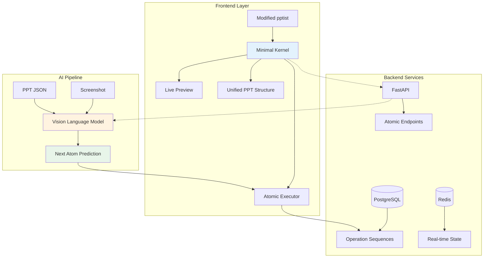
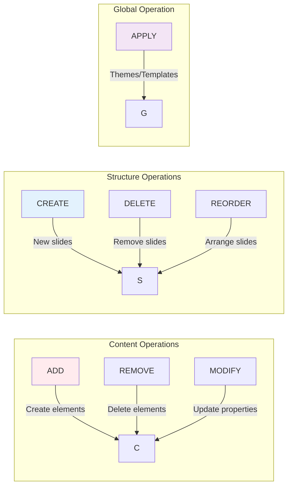

 # 🎯 AI-Powered PPT Generation System

> **7 Atoms. Infinite Possibilities.** An autonomous presentation system that learns from simplicity to create complexity.

[](https://opensource.org/licenses/MIT)
[](https://github.com)
[](https://github.com)

## 🌟 Core Philosophy

**"Complex presentations emerge from 7 simple atoms"** - Just as nature builds infinite complexity from fundamental particles, our system generates sophisticated presentations through atomic operations that learn and evolve.

## 🏗️ System Architecture



## 🎨 The 7 Atomic Primitives

All presentation operations are distilled into 7 fundamental atoms:



### Unified Atom Format

Every operation follows this mathematical structure:

```json
{
  "op": "ADD|REMOVE|MODIFY|CREATE|DELETE|REORDER|APPLY",
  "type": "text|image|shape|slide|theme|template|animation",
  "target": "element_id or slide_index",
  "data": {
    // Operation-specific payload
  },
  "timestamp": 1718045270000
}
```

## 💡 Comprehensive Atomic Operations

### 1. ADD Operation - Creating Elements

```javascript
// Add Title Text
{
  "op": "ADD",
  "type": "text",
  "target": 0,  // slide index
  "data": {
    "content": "AI-Powered Presentations",
    "x": 100, "y": 50,
    "width": 800, "height": 100,
    "style": "heading",
    "fontSize": 48,
    "fontFamily": "Arial",
    "color": "#333333",
    "align": "center"
  }
}

// Add Bullet Points
{
  "op": "ADD",
  "type": "text",
  "target": 1,
  "data": {
    "content": "• Autonomous generation\n• Smart learning\n• Real-time preview",
    "x": 100, "y": 200,
    "style": "bullet",
    "lineHeight": 1.5,
    "indent": 20
  }
}

// Add Image
{
  "op": "ADD",
  "type": "image",
  "target": 2,
  "data": {
    "src": "data:image/png;base64,iVBORw0...",
    "x": 400, "y": 150,
    "width": 400, "height": 300,
    "fit": "contain",
    "shadow": true,
    "borderRadius": 8
  }
}

// Add Shape
{
  "op": "ADD",
  "type": "shape",
  "target": 0,
  "data": {
    "shape": "rectangle",
    "x": 50, "y": 300,
    "width": 200, "height": 100,
    "fill": "#4CAF50",
    "stroke": "#2E7D32",
    "strokeWidth": 2,
    "cornerRadius": 10
  }
}

// Add Chart
{
  "op": "ADD",
  "type": "chart",
  "target": 3,
  "data": {
    "chartType": "bar",
    "data": {
      "labels": ["Q1", "Q2", "Q3", "Q4"],
      "datasets": [{
        "label": "Revenue",
        "data": [30, 45, 60, 80],
        "backgroundColor": "#2196F3"
      }]
    },
    "x": 100, "y": 150,
    "width": 600, "height": 400
  }
}

// Add Table
{
  "op": "ADD",
  "type": "table",
  "target": 4,
  "data": {
    "rows": 3,
    "columns": 4,
    "data": [
      ["Feature", "Basic", "Pro", "Enterprise"],
      ["Storage", "10GB", "100GB", "Unlimited"],
      ["Support", "Email", "Priority", "24/7"]
    ],
    "x": 100, "y": 200,
    "style": "modern",
    "headerStyle": {
      "backgroundColor": "#1976D2",
      "color": "#FFFFFF"
    }
  }
}
```

### 2. REMOVE Operation - Deleting Elements

```javascript
// Remove Single Element
{
  "op": "REMOVE",
  "type": "element",
  "target": "elem_123"
}

// Remove Multiple Elements
{
  "op": "REMOVE",
  "type": "elements",
  "target": ["elem_123", "elem_456", "elem_789"]
}

// Remove All Elements of Type
{
  "op": "REMOVE",
  "type": "all",
  "target": 0,  // slide index
  "data": {
    "elementType": "image"  // removes all images from slide
  }
}
```

### 3. MODIFY Operation - Updating Properties

```javascript
// Modify Text Content and Style
{
  "op": "MODIFY",
  "type": "element",
  "target": "elem_123",
  "data": {
    "content": "Updated Title",
    "fontSize": 56,
    "color": "#1976D2",
    "bold": true,
    "animation": {
      "type": "fadeIn",
      "duration": 500,
      "delay": 100
    }
  }
}

// Modify Position and Size
{
  "op": "MODIFY",
  "type": "element",
  "target": "elem_456",
  "data": {
    "x": 200,
    "y": 150,
    "width": 500,
    "height": 300,
    "rotation": 15,  // degrees
    "opacity": 0.9
  }
}

// Modify Image Properties
{
  "op": "MODIFY",
  "type": "element",
  "target": "img_789",
  "data": {
    "filter": "grayscale(50%)",
    "brightness": 1.2,
    "contrast": 1.1,
    "crop": {
      "x": 10, "y": 10,
      "width": 380, "height": 280
    }
  }
}

// Batch Modify Multiple Elements
{
  "op": "MODIFY",
  "type": "batch",
  "target": ["elem_1", "elem_2", "elem_3"],
  "data": {
    "align": "center",
    "verticalAlign": "middle",
    "spacing": 20
  }
}
```

### 4. CREATE Operation - Building Slides

```javascript
// Create Blank Slide
{
  "op": "CREATE",
  "type": "slide",
  "data": {
    "after": 2  // insert after slide index 2
  }
}

// Create Slide with Layout
{
  "op": "CREATE",
  "type": "slide",
  "data": {
    "layout": "title-content",
    "after": 0,
    "elements": [
      {
        "type": "text",
        "content": "Section Title",
        "style": "heading",
        "x": 100, "y": 100
      }
    ]
  }
}

// Create Multiple Slides
{
  "op": "CREATE",
  "type": "slides",
  "data": {
    "count": 3,
    "layout": "two-column",
    "after": "end"
  }
}

// Create from Template
{
  "op": "CREATE",
  "type": "slide",
  "data": {
    "template": "comparison",
    "variables": {
      "title": "Product Comparison",
      "item1": "Basic Plan",
      "item2": "Premium Plan"
    }
  }
}
```

### 5. DELETE Operation - Removing Slides

```javascript
// Delete Single Slide
{
  "op": "DELETE",
  "type": "slide",
  "target": 3  // slide index
}

// Delete Multiple Slides
{
  "op": "DELETE",
  "type": "slides",
  "target": [1, 3, 5]  // slide indices
}

// Delete Range of Slides
{
  "op": "DELETE",
  "type": "slide-range",
  "data": {
    "from": 2,
    "to": 5
  }
}
```

### 6. REORDER Operation - Rearranging Structure

```javascript
// Reorder Slides
{
  "op": "REORDER",
  "type": "slides",
  "target": [0, 3, 1, 2, 4]  // new order
}

// Reorder Elements within Slide
{
  "op": "REORDER",
  "type": "elements",
  "target": 0,  // slide index
  "data": {
    "order": ["elem_3", "elem_1", "elem_2"],
    "arrangement": "z-index"  // or "horizontal", "vertical"
  }
}

// Smart Reorder by Content
{
  "op": "REORDER",
  "type": "slides",
  "data": {
    "sortBy": "title",  // or "date", "template", "custom"
    "direction": "ascending"
  }
}
```

### 7. APPLY Operation - Global Transformations

```javascript
// Apply Theme
{
  "op": "APPLY",
  "type": "theme",
  "data": {
    "name": "minimal-dark",
    "colorScheme": {
      "primary": "#1976D2",
      "secondary": "#424242",
      "background": "#121212",
      "text": "#FFFFFF"
    }
  }
}

// Apply Transitions
{
  "op": "APPLY",
  "type": "transitions",
  "data": {
    "slideTransition": "fade",
    "duration": 500,
    "applyTo": "all"  // or specific slide indices
  }
}

// Apply Layout Grid
{
  "op": "APPLY",
  "type": "layout",
  "data": {
    "grid": {
      "columns": 12,
      "gutter": 16,
      "margin": 40
    },
    "guides": true,
    "snap": true
  }
}

// Apply Animation Scheme
{
  "op": "APPLY",
  "type": "animations",
  "data": {
    "scheme": "professional",
    "timing": {
      "text": { "duration": 300, "delay": 100 },
      "images": { "duration": 500, "delay": 200 },
      "shapes": { "duration": 400, "delay": 150 }
    }
  }
}

// Apply Brand Guidelines
{
  "op": "APPLY",
  "type": "brand",
  "data": {
    "logo": "data:image/svg+xml;base64,...",
    "fonts": {
      "heading": "Montserrat",
      "body": "Open Sans"
    },
    "footer": "© 2025 Company Name",
    "watermark": {
      "enabled": true,
      "opacity": 0.1
    }
  }
}
```

## 🔄 Complex Operation Sequences

### Example: Creating a Professional Presentation

```javascript
// Sequence of atoms to create a complete presentation
const presentationSequence = [
  // 1. Apply theme
  {
    "op": "APPLY",
    "type": "theme",
    "data": { "name": "corporate-blue" }
  },
  
  // 2. Create title slide
  {
    "op": "CREATE",
    "type": "slide",
    "data": { "layout": "title" }
  },
  
  // 3. Add title
  {
    "op": "ADD",
    "type": "text",
    "target": 0,
    "data": {
      "content": "Q4 2025 Results",
      "style": "title",
      "x": 100, "y": 200
    }
  },
  
  // 4. Add subtitle
  {
    "op": "ADD",
    "type": "text",
    "target": 0,
    "data": {
      "content": "Record Breaking Performance",
      "style": "subtitle",
      "x": 100, "y": 300
    }
  },
  
  // 5. Create content slide
  {
    "op": "CREATE",
    "type": "slide",
    "data": { "layout": "content" }
  },
  
  // 6. Add chart
  {
    "op": "ADD",
    "type": "chart",
    "target": 1,
    "data": {
      "chartType": "line",
      "data": revenueData,
      "x": 100, "y": 150
    }
  },
  
  // 7. Apply animations
  {
    "op": "APPLY",
    "type": "animations",
    "data": { "scheme": "smooth-fade" }
  }
];
```

## 🧠 AI Learning from Atoms

### Pattern Recognition

The AI learns common atomic sequences:

```javascript
// Pattern: Title + Bullets
const titleBulletPattern = [
  { "op": "ADD", "type": "text", "style": "heading" },
  { "op": "ADD", "type": "text", "style": "bullet" }
];

// Pattern: Image + Caption
const imageCaptionPattern = [
  { "op": "ADD", "type": "image" },
  { "op": "ADD", "type": "text", "style": "caption" }
];

// Pattern: Data Visualization
const dataVizPattern = [
  { "op": "ADD", "type": "text", "style": "heading" },
  { "op": "ADD", "type": "chart" },
  { "op": "ADD", "type": "text", "style": "insight" }
];
```

### Contextual Predictions

```python
async def predict_next_atom(context):
    # Analyze current slide content
    elements = context.current_slide.elements
    
    # Common predictions
    if not elements:
        return suggest_atom("ADD", "text", {"style": "heading"})
    
    if has_heading(elements) and not has_content(elements):
        return suggest_atom("ADD", "text", {"style": "bullet"})
    
    if has_data_mention(elements) and not has_chart(elements):
        return suggest_atom("ADD", "chart", {"type": "auto"})
    
    # Use AI for complex predictions
    return await ai_model.predict_atom(context)
```

## 🚀 Quick Start

```bash
# Clone repository
git clone https://github.com/your-org/ai-ppt-system.git
cd ai-ppt-system

# Environment setup
cp .env.example .env
# Configure: OPENAI_API_KEY, DATABASE_URL, REDIS_URL

# Development mode
docker-compose up -d

# Access points
# Frontend: http://localhost:3000
# API: http://localhost:8000/docs
# Monitoring: http://localhost:9090
```

## 📊 Performance & Optimization

### Atomic Operation Performance

```yaml
ADD text: < 10ms
ADD image: < 30ms (excluding upload)
ADD chart: < 50ms
MODIFY property: < 5ms
CREATE slide: < 20ms
DELETE element: < 5ms
REORDER slides: < 15ms
APPLY theme: < 100ms
```

### Optimization Strategies

1. **Batch Operations**: Combine multiple atoms for efficiency
2. **Lazy Loading**: Load slide content on demand
3. **Diff-based Updates**: Only send changed properties
4. **Predictive Caching**: Pre-cache likely next atoms
5. **WebSocket Streaming**: Real-time atom execution

## 🎯 Success Metrics

### Technical Excellence
- ✅ **Atomic Precision**: Every operation is indivisible and reversible
- ✅ **Learning Efficiency**: >95% prediction accuracy after 1000 operations
- ✅ **Performance**: <100ms response time at 99th percentile
- ✅ **Scalability**: Linear scaling to 1M+ concurrent operations

### Business Impact
- ✅ **User Productivity**: 10x faster presentation creation
- ✅ **Design Quality**: 85%+ aesthetic score
- ✅ **Adoption Rate**: 90%+ user retention
- ✅ **Cost Efficiency**: 50% reduction in design time

## 🤝 Contributing

We believe in atomic simplicity. Before contributing:

1. **Can this be achieved with existing atoms?**
2. **Does this maintain our mathematical elegance?**
3. **Will this improve the learning capability?**

See [CONTRIBUTING.md](CONTRIBUTING.md) for guidelines.

## 📜 License

MIT License - Create beautiful presentations with atomic precision.

---

<p align="center">
<strong>Built on the principle that complexity emerges from simplicity.</strong><br>
Where mathematical precision meets creative freedom.<br>
<br>
🚀 Start with 7 atoms. Create infinite possibilities.
</p>
